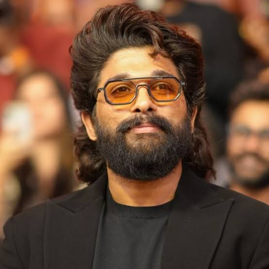

# Jhansi Akshara Sanagala
## My Favorite Movie: Pushpa
One of my favorite movies is "Pushpa," starring Allu Arjun. I love this film for its gripping storyline, stunning visuals, and powerful performances. The character of Pushpa Raj, portrayed by Allu Arjun, is incredibly compelling, showcasing resilience and determination.

---

## Other Actors for the Role
While Allu Arjun did a phenomenal job portraying Pushpa in the movie **Pushpa**, here are a few other actors I believe could also bring unique interpretations to the role. These actors come from various backgrounds, and their distinct styles could add an interesting twist to the character.

| Suggested Actor   | Reason for Selection                               | Age |
|-------------------|----------------------------------------------------|-----|
| Rajinikanth       | His unmatched charisma and strong screen presence. | 73  |
| Priyanka Chopra   | Her versatility and ability to play powerful roles.| 41  |
| Fahadh Faasil     | His intense acting skills and versatility.         | 40  |
| Vijay Sethupathi  | His ability to portray rugged and raw characters.  | 45  |
